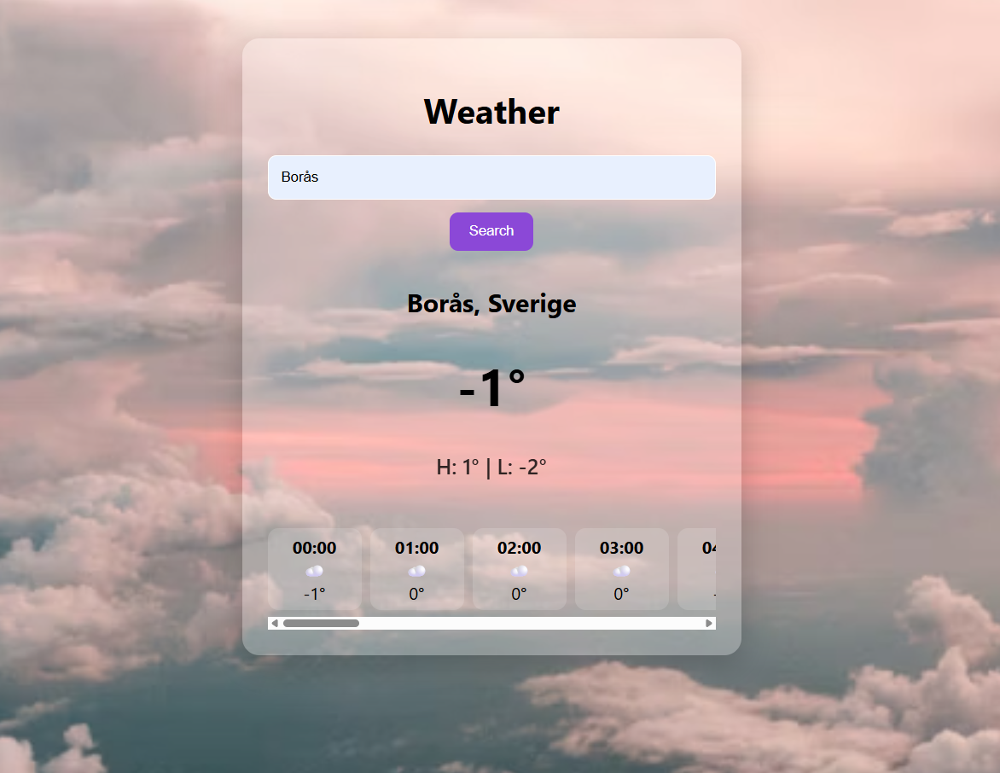

# 🌤 WeatherAppSimple

En enkel och modern väderapplikation där du kan söka väder i valfri stad i världen.  
Byggd för att lära och demonstrera praktisk utveckling med **.NET 8 Minimal API** + **Vanilla Frontend (HTML/CSS/JS)**.

---

## 🖼 Preview

---

## ✨ Funktioner

| Funktion | Status |
|--------|:---:|
| Sök vilken stad som helst i världen 🌍 | ✔️ |
| Live-väderdata via Open-Meteo API | ✔️ |
| Visar temperatur i heltal (avrundad) | ✔️ |
| High/Low temperatur för dagen | ✔️ |
| Tim-för-timme prognos (horisontell scroll) | ✔️ |
| Sök även med Enter-tangenten | ✔️ |
| Transparent UI-kort med bakgrundsbild | ✔️ |

---

## 🔧 Teknikstack

| Del | Teknologi |
|-----|----------|
| Backend | .NET 8 Minimal API |
| HTTP requests | HttpClient |
| Frontend | HTML + CSS + JavaScript |
| Data hämtas från | Open-Meteo.com Weather API |
| Versionshantering | Git & GitHub |

---

## 🚀 Starta projektet här !
